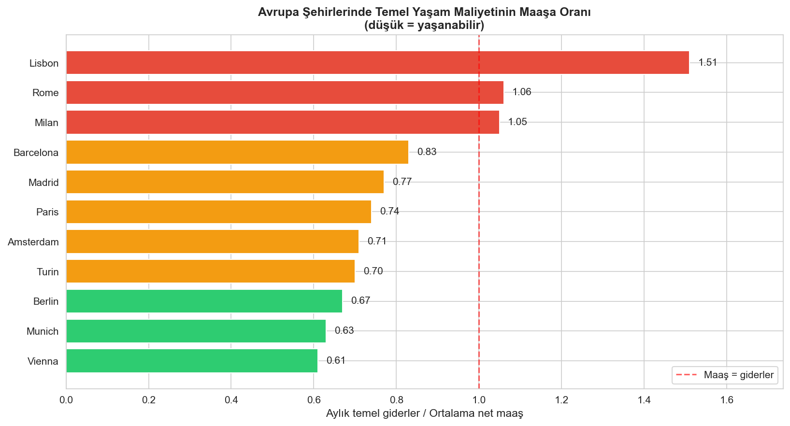
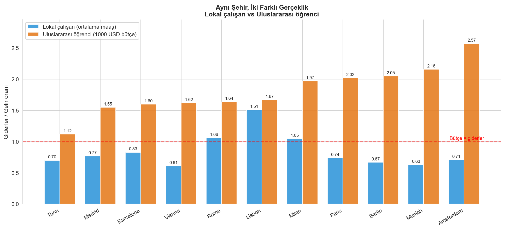

# Cost of Living for International Students in Europe

An exploratory analysis comparing affordability across 11 major European
cities through two different lenses: the local average wage, and a fixed
international student budget.

## Key findings

1. **Cheap on paper ≠ affordable in practice.** Lisbon, despite low
   absolute prices, has the worst affordability ratio (1.51) for its
   own residents — wages haven't kept up with rent and groceries.
2. **Absolute and relative views can disagree.** Turin has the best
   affordability ratio but lands mid-pack in absolute savings potential
   because both salary and costs are low.
3. **Affordability depends on whose income you use.** On a fixed 1000 USD
   student budget, *every single city* in the analysis is over the
   break-even line. Amsterdam in particular flips from "good for locals"
   (0.71) to "worst for students" (2.57).

## Stack

Python · Pandas · Matplotlib · Seaborn · Jupyter

## Data

[Global Cost of Living](https://www.kaggle.com/datasets/mvieira101/global-cost-of-living)
on Kaggle (Numbeo, May 2022 snapshot). 4,874 cities × 55 price columns,
filtered down to 248 quality-checked European cities and a focus set of 11
major student hubs.

## Selected visualizations

## Limitations

A short, honest list — these matter when interpreting the charts:

- Numbeo data is crowd-sourced; even quality-flagged values reflect
  contributor demographics rather than full markets.
- Snapshot is from May 2022 — rents in Lisbon, Berlin, and Amsterdam in
  particular have moved significantly since.
- Average net salary is a rough proxy for "typical local" and hides
  within-city inequality.
- Grocery consumption multipliers are reasonable personal estimates, not
  validated against survey data.
- Student budget is a single fixed assumption (1000 USD); a sensitivity
  analysis across 800/1000/1200 would strengthen the conclusion.

## Possible next steps

- Layer in 2024–2025 rent data from Idealista or Immobiliare.it for current
  numbers.
- Add a sensitivity analysis on the student budget assumption.
- Extend the city set to 20+ and use ranking robustness across multiple
  metrics.

## Author

Emirhan Ömer — Computer Engineering student at Politecnico di Torino.